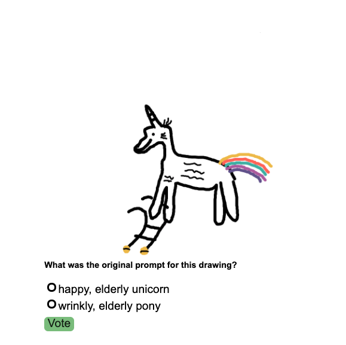

# Drawy draw 

## What's this?
A game of sketches and deceit! Players take turns:

- Entering words to generate prompts out of
- Making a drawing out of a prompt
- Coming up with decoy prompts for a drawing
- Voting for the original prompt that inspired a drawing
## Playing the game
You can play the latest version at https://drawydraw.herokuapp.com
## Local development
### Client
- Enter the client directory
- Run `npm run dev`
- Client should be available at `localhost:8080`
- To lint and fix style issues run `npm run fixlint`
- To run the few client tests run `npm run test`
### Server
- Enter the server directory
- Run `go run main.go`
- Service should be available at `localhost:3000`
- To run tests, run `go test ./...` from the server root
## Deploying
The master branch gets automatically deployed to heroku after a successful, automatic CI job.
